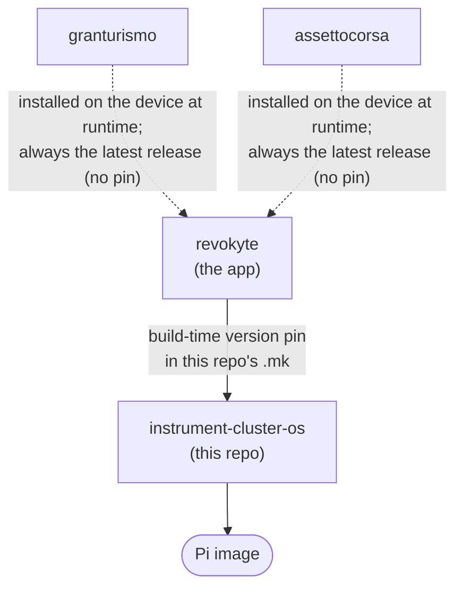

# Building a Raspberry Pi image

This guide explains how to produce a flashable Raspberry Pi image for
the instrument cluster when one or more of the source repositories change.
It assumes **no prior knowledge** of how the pieces fit together.

> **The one rule to remember:** build from the *bottom up*. The image is built
> **last**, after every library it depends on has been released. If you build the
> image before releasing a changed library, the image will pull the *old* version.

---

## 1. The repositories and how they connect

| Repo | What it is | How it reaches the device |
|------|------------|---------------------------|
| [`granturismo`](https://github.com/chrshdl/granturismo) | GT7 telemetry feed (decrypts the PlayStation UDP stream) | **Not in the image.** The app downloads it **at runtime on the device** and always installs the **latest** published GitHub Release — there is no pinned version. |
| [`assettocorsa`](https://github.com/chrshdl/assettocorsa) | ACC telemetry feed (reads ACC's UDP Broadcasting API) | **Not in the image.** Same as granturismo — the app downloads the **latest** Release **at runtime on the device** when the user selects ACC. No pinned version. |
| [`revokyte`](https://github.com/revokyte/revokyte) | The application (the UI you see on screen) | Built **from source at image-build time**, baked into the image. |
| [`instrument-cluster-os`](https://github.com/chrshdl/instrument-cluster-os) | The Buildroot project (**this repo**) that assembles everything into a Pi image | This is what you build. |

### Dependency direction



Read it as: **arrows point toward the thing that consumes them.** A solid arrow
is a *build-time* dependency — whatever it points *into* must be re-pinned and
rebuilt after the source changes. The **dashed** arrows are *runtime* dependencies:
the telemetry feeds (granturismo, assettocorsa) are fetched by the device when the
user installs the feed for their game, so a new feed release reaches devices
**without** rebuilding anything — they just pick up the latest on the next install.

### Where each version is "pinned"

A *pin* is the single place that records "use exactly this version". Changing a
library has no effect until you update its pin and rebuild the consumer.

| Library | Pinned in | Field |
|---------|-----------|-------|
| `revokyte` (the app) | **this repo** → `package/python-instrument-cluster/python-instrument-cluster.mk` | `PYTHON_INSTRUMENT_CLUSTER_VERSION = 0.3.1` |

> Current version above is an example — check the file for the live value.

**The telemetry feeds (`granturismo`, `assettocorsa`) are intentionally not in this
table.** They have no version pin: the app resolves the latest release from each
feed's GitHub Releases API at install time (`resolve_latest_tarball_url()` in
`src/instrument_cluster/addons/installer.py`, driven by the feed descriptors in
`src/instrument_cluster/addons/feeds.py`). Publish a feed release and devices pick
it up on their next install of that feed.

---

## 2. How a release happens in each repo

Every library is shipped by **pushing a git tag** named `vX.Y.Z`. That tag fires
a GitHub Actions workflow that builds the artifact and publishes a GitHub Release.

| Repo | Tag triggers | What it produces |
|------|--------------|------------------|
| `granturismo` | `v*` → *Build self-contained tarball* | `granturismo-selfcontained-<ver>.tar.gz` (+ `.sha256`, `.sig`) on a Release |
| `assettocorsa` | `v*` → *Build self-contained tarball* | `acc-selfcontained-<ver>.tar.gz` (+ `.sha256`, `.sig`) on a Release |
| `revokyte` | `v*` → *Bump OS package* | **Auto-commits** the new version + source hash into this repo's `python-instrument-cluster.mk` / `.hash` |
| `instrument-cluster-os` (this repo) | `v*` → *CI instrument-cluster* | The Pi image (factory image + legal-info bundle) on a Release |

Two important consequences:

- **revokyte (the app) *does* auto-update this repo** (via its *Bump OS package*
  workflow), but it does **not** build an image. You still have to tag this repo
  to actually build the image.
- **granturismo needs no follow-up here at all.** Because the device fetches the
  latest granturismo at runtime, releasing it does not require an app release or
  an image rebuild — deployed devices get it on their next proxy install.

---

## 3. Prerequisites (one-time)

- The [`gh` CLI](https://cli.github.com/) installed and logged in
  (`gh auth login`), with access to the `chrshdl` repos.
- The **`revokyte` repo** (the app) has a secret **`INSTRUMENT_CLUSTER_OS_REPO_PAT`**
  (a PAT with `contents:write` on `instrument-cluster-os`). Its *Bump OS package*
  workflow uses it to commit the version/hash bump here. If an app release
  doesn't produce a bump commit here, this secret is missing or expired.

---

## 4. The golden order (when everything changed)

Do these **in order**. Do not skip ahead — each step depends on the previous
release already existing.

### Step 1 — Release `granturismo` (if it changed)

```bash
cd granturismo
# bump "version" in pyproject.toml, commit
git tag v0.3.15 && git push origin v0.3.15
```

Wait for the *Build self-contained tarball* workflow to finish and confirm the
release assets exist:

```bash
gh release view v0.3.15 --repo chrshdl/granturismo
```

That's the **only** step granturismo needs. There is nothing to pin and no image
to rebuild on its behalf — devices install the latest release at runtime. (If
granturismo did **not** change, skip this step.)

> The **`assettocorsa`** (ACC) feed works identically — tag `v*` to publish
> `acc-selfcontained-<ver>.tar.gz`, and devices fetch the latest at runtime when the
> user selects ACC. Everywhere this guide says "granturismo" for the runtime-fetched
> feed, the same applies to `assettocorsa`; neither needs a pin or an image rebuild.

### Step 2 — Release `revokyte` (the app)

```bash
cd revokyte
# commit & push your changes first
git tag v0.3.2 && git push origin v0.3.2
```

This fires the app's *Bump OS package* workflow, which **automatically commits**
`PYTHON_INSTRUMENT_CLUSTER_VERSION = 0.3.2` and the new source hash into this
repo. Confirm it landed:

```bash
cd instrument-cluster-os
git pull
grep VERSION package/python-instrument-cluster/python-instrument-cluster.mk
```

### Step 3 — Build the image (this repo, **last**)

Now that every pin in this repo points at a released version, tag this repo to
build and publish the image:

```bash
cd instrument-cluster-os
git pull                      # make sure you have the auto-bump commit
git tag v0.1.3 && git push origin v0.1.3
```

This builds the Pi image for both boards (`raspberrypi4-64`, `raspberrypi5`) and,
because it is a tag, also produces the **factory image** and **legal-info bundle**
and uploads them to the image Release.

```bash
gh run watch --repo chrshdl/instrument-cluster-os
gh release view v0.1.3 --repo chrshdl/instrument-cluster-os   # see the images
```

> A full image build takes roughly **1–2 hours per board**.

---

## 5. Partial changes — what to actually do

You rarely change everything. Use the matching scenario below. The principle for
the app is always the same: **release it, let the pin auto-bump, then rebuild the
image.** granturismo is the exception — it never needs an image rebuild.

### A. Only `granturismo` changed
Just release granturismo (§4 Step 1). **No app release and no image rebuild
required** — deployed devices install the latest granturismo the next time the
user runs the proxy install. (The only time you'd also rebuild the image is if
the devices in the field are *older than* the version of the app that introduced
the "install latest" behaviour.)

### B. Only `revokyte` (the app) changed
1. Release the app (§4 Step 2) — this auto-bumps this repo.
2. Build the image (§4 Step 3).

### C. Only `instrument-cluster-os` (this repo) changed
No libraries to release. Just build the image (§4 Step 3).

### D. granturismo **and** the app changed
Release granturismo (§4 Step 1) and release the app (§4 Step 2), then build the
image (§4 Step 3). The two are independent — granturismo reaches devices at
runtime, the app change reaches them via the new image.

> **In every scenario the image build (§4 Step 3) is the last step**, and it only
> bakes in what has been released and pinned at the time you tag it. The sole
> thing it does *not* govern is granturismo, which devices fetch at runtime.

---

## 6. Building without releasing (validation / local)

> **Image variants:** every non-tag build (local, PR, manual dispatch) produces
> the **dev** variant — SSH enabled, root login with password `root` — which is
> what the revokyte dev loop (`deploy_pi.sh`, `ssh root@instrument-cluster.local`)
> needs. Only `v*` tag builds produce the hardened **release** variant (no SSH
> server, root account locked); CI merges `configs/release.fragment` and
> hard-fails via `scripts/assert-release-image.sh` if the hardening didn't take.

- **Validate the image build without publishing:** run the workflow manually.
  It builds both boards but skips the release upload (tag-only):
  ```bash
  gh workflow run "CI instrument-cluster" --repo chrshdl/instrument-cluster-os --ref main
  ```
- **Pull-request builds:** opening a PR against this repo also builds the image
  if the PR carries the `build` label (builds are opt-in on PRs), so changes can
  be validated before merge.
- **Grab a flashable dev image from CI:** non-tag builds upload
  `dev-<ref>-<board>.img` as a workflow artifact (14-day retention) — download
  it from the run's page instead of building locally.
- **Fully local build** (advanced) requires the Buildroot toolchain and a
  populated download cache. The GitHub Actions workflow is the supported path.
  To test the *release* variant locally, see "Image variants" in `CLAUDE.md`.

---

## 7. Quick checklist

```
[ ] granturismo changed?      → tag granturismo  (done — devices fetch latest at runtime)
[ ] app changed?              → tag revokyte (auto-bumps this repo)
[ ] git pull this repo (pick up auto-bump commit)
[ ] tag this repo (vX.Y.Z) → image builds & publishes
```

> If *only* granturismo changed, you can stop after the first line — no image
> rebuild is needed.

